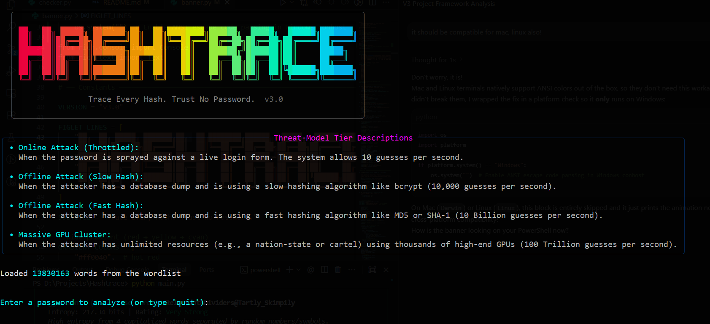
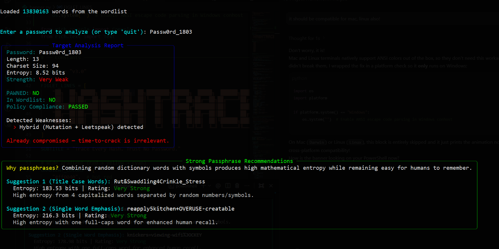
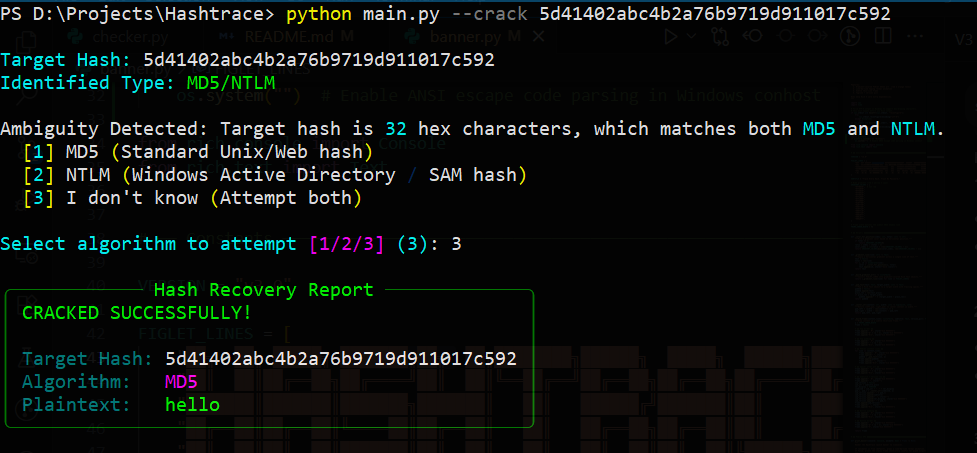
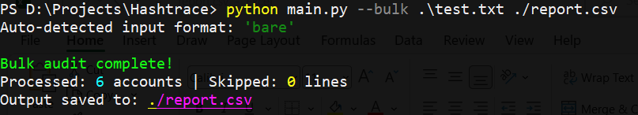
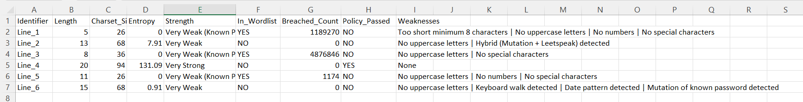

# HashTrace

Password intelligence tool. Analyzes passwords like an attacker would, audits credential dumps, and cracks hashes — all from the terminal.

<p align="left">
  
</p>

## Disclaimer

This tool is for defensive security auditing, education, and authorized testing only. The hash cracking and bulk audit features can process real credential data — only use them on data you own or have explicit written permission to test. If you're using stolen hashes or unauthorized password dumps, that's on you, not this tool. All analysis runs locally — the only external call is to HaveIBeenPwned, and even then, only the first 5 characters of a hash are sent(using k-anonymity), never the actual password.

## What is this and why

Most password strength meters lie to you. They'll tell you `thisisaverylongpassword` is *"Strong"* because it's 22 characters — ignoring that it's all lowercase and crackable in seconds with a basic dictionary attack. I built HashTrace to evaluate passwords the way an actual attacker would: checking breach databases, catching leet-speak tricks like `p@ssw0rd`, detecting keyboard walks like `qwertyuiop`, and showing you how long your password actually survives against four different attacker setups — from a rate-limited login form to a nation-state GPU cluster.

I tried showing one flat crack-time estimate at first. Then I realized it's dishonest — 170 bits of entropy against bcrypt is centuries, against raw MD5 it's seconds. Same password. So HashTrace shows all four tiers, because the truth depends on how the password is stored, not just what it is.

The four tiers:
- **Online (Throttled)** — 10 guesses/sec, like a login form with rate limiting
- **Offline (Slow Hash)** — 10,000 guesses/sec, like bcrypt or Argon2
- **Offline (Fast Hash)** — 10 billion guesses/sec, like raw MD5 or SHA-1
- **GPU Cluster** — 100 trillion guesses/sec, nation-state or dedicated cracking rigs

## What it actually does

HashTrace runs in three modes.

**Interactive mode** — you type a password, it tears it apart. It checks rockyou.txt (13.8M leaked passwords), queries HaveIBeenPwned via k-Anonymity (**your password never leaves your machine**), and runs pattern detection for mutations, leet-speak, keyboard walks, and date suffixes.

Then it calculates entropy with penalties that actually punish predictable structure. If the password is already compromised, it says so — no fake crack-time estimate on top of that. If it's clean, you get time-to-crack across all four threat tiers.

If the password is weak, it suggests two strong passphrases built from random dictionary words — easy to remember, hard to crack. It also checks against your organization's password policy if you've set one up.

**Bulk mode** — feed it a password dump (bare passwords or `username,password` format, auto-detected), get a CSV audit report back. **Raw passwords never touch the output file** — the report references accounts by identifier only, because writing live credentials into a second file on disk defeats the point of an audit.

**Crack mode** — give it a hash, it identifies the algorithm by length (MD5, NTLM, SHA-1, SHA-256, SHA-512), asks you to resolve the MD5/NTLM ambiguity if it can't tell, and runs an in-memory dictionary attack against rockyou.txt. If it doesn't crack it, it tells you straight — *a wordlist miss doesn't mean the password is safe*, it just means it wasn't in this particular list.

## How it works

```
Password Input
      |
      +-- checker.py -- rockyou.txt lookup
      |                  +-- mutation detection (strip prefix/suffix, re-check)
      |                  +-- leet-speak normalization (p@ssw0rd -> password -> re-check)
      |                  +-- keyboard walk detection (precomputed 4-char horizontal sequences)
      |                  +-- date pattern detection (4-digit year, 1940-2030)
      |
      +-- checker.py -- HIBP k-Anonymity query
      |                  (SHA-1 hash, send first 5 chars only, compare locally)
      |
      +-- analyzer.py -- entropy calculation
      |                   +-- base: log2(charset_size) * length
      |                   +-- penalties: multiplicative stacking (mutations, leet, walks, dates)
      |                   +-- hard cap: 45 bits max for lowercase-only strings
      |                   +-- strength label: Very Weak -> Very Strong
      |
      +-- analyzer.py -- time-to-crack (4 tiers)
      |                   seconds = 2^entropy / guesses_per_sec
      |                   (skipped entirely if password is already breached)
      |
      +-- policy.py -- organizational rule check (from policy.json)
      |
      +-- suggestions.py -- Diceware passphrase generator
                             (4 words from EFF wordlist, random separators)
                             (only shown when the password actually needs fixing)
```

The design is straightforward: `analyzer.py` does math, `checker.py` does lookups and transformations, everything else is a module that plugs in without touching the core. Hash cracking (`cracker.py`) is entirely separate — different input type, different flow, only triggered via `--crack`.

## Setup

For a quick setup that automatically installs the requirements and downloads the 130MB `rockyou.txt` wordlist:

**Windows:**
```cmd
setup.bat
```

**Linux / macOS:**
```bash
chmod +x setup.sh
./setup.sh
```

**Manual Setup:**
```bash
git clone https://github.com/wizard1803/hashtrace.git
cd hashtrace
pip install -r requirements.txt
```

You need two wordlists in a `Wordlists/` folder:

- **`rockyou.txt`** — the tool checks passwords against this and uses it for hash cracking. (The setup scripts will download this for you).
- **`eff_large_wordlist.txt`** — shipped with the repo. Used only for generating passphrase suggestions. This is the EFF's curated Diceware list, not leaked data.

Tested on Python 3.10+ on Windows. Should work on Linux and macOS.

## Usage

**Interactive:**
```bash
python main.py
```
Type passwords, get a full report — entropy, breach status, pattern detection, crack times, policy compliance, and passphrase suggestions if the password is weak.

**Bulk audit:**
```bash
python main.py --bulk passwords.txt report.csv --skip-hibp
```
Processes a full password dump and outputs a CSV report (without saving raw passwords to the CSV).

> **Note on `--skip-hibp`**: The HaveIBeenPwned public API enforces a strict rate limit of ~1 request per 1.5 seconds. To avoid getting your IP temporarily banned (HTTP 429 errors), HashTrace intentionally injects a 1.6-second delay between every password checked in bulk mode.
>
> Because of this built-in delay, checking a dump of just 1,000 passwords will take nearly half an hour. We strongly recommend using `--skip-hibp` for large datasets to bypass the network check entirely and run the audit locally at maximum speed.

The tool auto-detects two input formats for `passwords.txt`:
1. **Bare passwords:** (One password per line)
   ```text
   password123
   admin
   hunter2
   ```
2. **Username/Password pairs:** (Separated by a comma)
   ```text
   jsmith,P@ssw0rd2024
   admin,admin
   ```

**Hash cracking:**
```bash
python main.py --crack 5d41402abc4b2a76b9719d911017c592
```
Identifies the hash type, runs an in-memory dictionary attack against rockyou.txt. Supports MD5, NTLM, SHA-1, SHA-256, SHA-512. Asks you to pick between MD5 and NTLM when it can't tell (both are 32 hex chars), or tries both if you don't know.

## Policy configuration

Drop a `policy.json` in the project root to enforce organizational rules:

```json
{
    "min_length": 12,
    "require_uppercase": true,
    "require_lowercase": true,
    "require_numbers": true,
    "require_symbols": true
}
```

Missing or malformed fields fall back to defaults instead of breaking the tool.

## Screenshots











## What this doesn't do

- No live network attacks. No credential stuffing. No brute-force against login endpoints.
- Hash cracking is dictionary-only, in-memory, single-threaded. A wordlist miss doesn't mean the password is strong — it means it wasn't in rockyou.
- No rainbow tables, no rule-based mutations during cracking, no GPU acceleration.
- No Levenshtein/similarity matching yet — I need to get better at dynamic programming first. *That's on me, not the tool.*

## License

This project is licensed under the MIT License — see the [LICENSE](LICENSE) file for details. 

**TL;DR:** You can use, modify, and distribute this code freely for both commercial and personal use. Just don't hold me liable for what you do with it.

### Acknowledgements
* The [EFF Large Wordlist](https://www.eff.org/dice) included in this repository is created by the Electronic Frontier Foundation and licensed under [CC BY 3.0 US](https://creativecommons.org/licenses/by/3.0/us/).